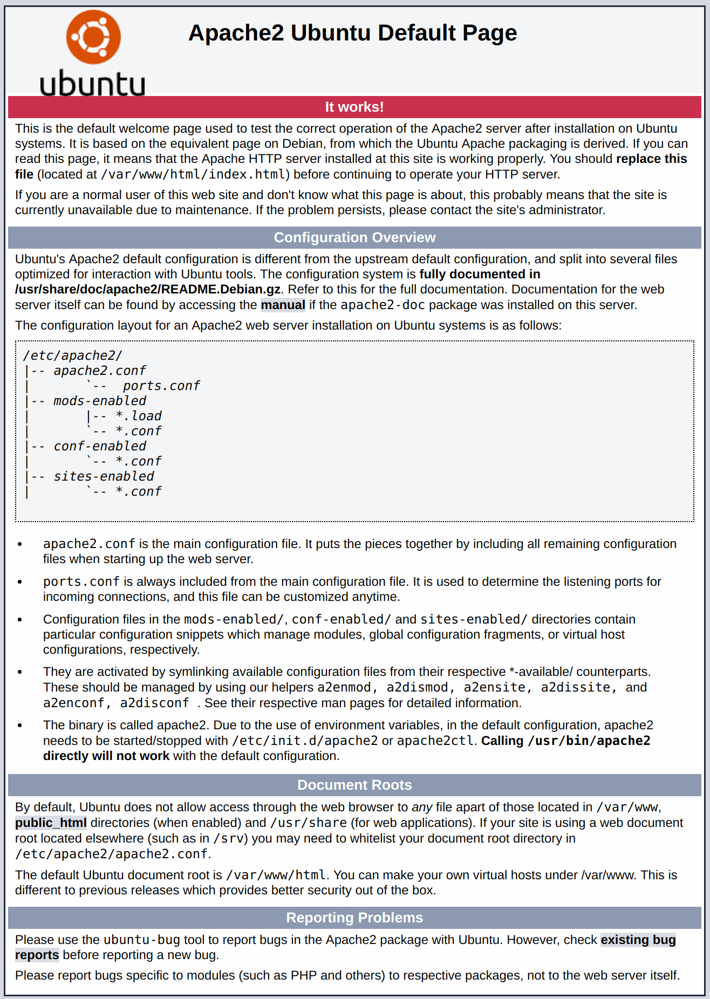
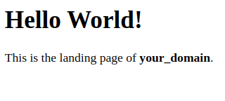
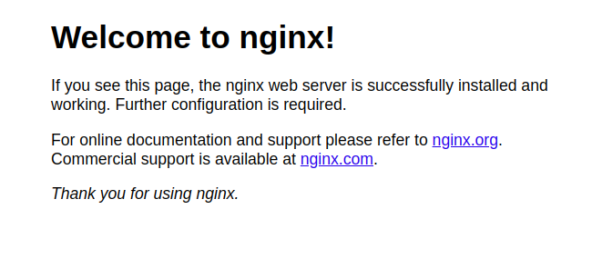

This Installation Guide is prepared for **Ubuntu** Operating System. Of course, you can use any unix-based system, but in this case you need to adopt this manual by youself.
Before your start make sure your have a **dedicated (virtual) server with root permission**. On a usual hosting the system will not work!

## 1. Linux Server Preparation
This section will describe how to prepare server for an installation of AtroCore Application.
* [Apache web server preparation](./web-server-preparation-apache.md) (RECOMMENDED)
* [Nginx web server preparation](./web-server-preparation-nginx.md)

## 2. Install AtroCore (AtroPIM, AtroDAM, etc) Application
This section describes how to install AtroCore Application on the prepared web server.

### 1. Create your project directory (if not exists yet)
> if the directory already exists, remove everything inside the directory.

To create the directory, run the command:
```
mkdir /var/www/my-atrocore-project 
```
> **my-atrocore-project** – project name

### 2. Go inside of your project directory
```
cd /var/www/my-atrocore-project 
```

### 3. Download project files

> Git may be used for this step, so make sure that [git](https://git-scm.com/book/en/v2/Getting-Started-Installing-Git) is installed. Please note, it is still possible to install the application without having `git` (see 3.6).

> It is essential, that you use the composer version, which is embedded in our software, because this version contains some of our modifications needed for backup and restoring of the system files and the database. That is why `php composer.phar update` is used. Please **DO NOT** use composer, which is installed on your server as it does not contain the required modifications.

#### 3.1. If you want to install AtroPIM and AtroDAM with demo data
> Demo data can be installed only for MySQL database system.

run
```
git clone https://github.com/atrocore/skeleton-pim.git . && php composer.phar self-update && php composer.phar update
```

#### 3.2. If want want to install the AtroPIM and AtroDAM without demo data

run
```
git clone https://github.com/atrocore/skeleton-pim-no-demo.git . && php composer.phar self-update && php composer.phar update
```

#### 3.3. If you want to install AtroDAM with demo data
> Demo data can be installed only for MySQL database system.

run
```
git clone https://github.com/atrocore/skeleton-dam.git . && php composer.phar self-update && php composer.phar update
```

#### 3.4. If you want to install AtroDAM without demo data

run
```
git clone https://github.com/atrocore/skeleton-dam-no-demo.git . && php composer.phar self-update && php composer.phar update
```

#### 3.5. If you want to install AtroCore only
Please install AtroDAM and than remove AtroDAM module via Administration > Module Manager.

#### 3.6. Installation without `git` 
If you have no git installed you may still copy the files to the project folder manually.

You can download the files from one of this directory:
- https://github.com/atrocore/skeleton-pim
- https://github.com/atrocore/skeleton-pim-no-demo
- https://github.com/atrocore/skeleton-dam 
- https://github.com/atrocore/skeleton-dam-no-demo

Than upload the files to your project folder and run
```
php composer.phar update
```

### 4. Change recursively the user and group ownership for your project files
```
chown -R www-data:www-data /var/www/my-atrocore-project/
```
> Ubuntu and Debian use **www-data** as a standard user for the webserver. This can also be one of the following: www, apache2, psacln etc.

### 5. Change the permissions for project files
```
find . -type d -exec chmod 755 {} + && find . -type f -exec chmod 644 {} +;
```
```
find client data custom upload -type d -exec chmod 775 {} + && find client data custom upload -type f -exec chmod 664 {} +
```    
### 6. Configure the crontab
   6.1. Open crontab for your webserver user, which is www-data in our case:
```
crontab -e -u www-data
``` 
   6.2. Add the following configuration:
```      
* * * * * /usr/bin/php /var/www/my-atrocore-project/index.php cron
```
> Please consider that `/usr/bin/php` is the correct path to PHP in our case. You may have other path. "cron" is the required parameter and should be definitely included for appropriate functioning.

### 7. Create MySQL database and user

User must have all privileges for the database, which should be used for the AtroCore Application. You can create database and user with all privileges by executing next few commands:

> If MySQL Database is not installed, you need to install it.

Connect to MySQL as a root user:
```
mysql -u root -p
```
Create the database **atrocore**:
```
CREATE DATABASE atrocore;
```
Create user **atrocore_user** with password **atrocore_password** and grant all needed privileges:
```
CREATE USER 'atrocore_user'@'localhost' IDENTIFIED BY 'atrocore_password';
GRANT ALL ON atrocore.* TO atrocore_user@localhost WITH GRANT OPTION;
```

### 8. Go to your Project URL to start the installation wizard 

Start the installation wizard for your AtroCore Application in the web interface from your URL: http://YOUR_PROJECT/ . Follow the instructions in the wizard.


<br/><br/><br/><br/>

# Apache Web Server Preparation
This guide describes how to prepare the web server for the installation of AtroCore Applications.

> Installation guide is based on **Ubuntu 20.04**.

## 1. Installing Apache and Updating the Firewall
The Apache web server is among the most popular web servers in the world. It’s well documented, has an active community of users, and has been in wide use for much of the history of the web, which makes it a great default choice for hosting a web application.

Install Apache using Ubuntu’s package manager, ```apt```:
```
sudo apt update
sudo apt -y install apache2
```

Enable mod_rewrite:
```
sudo a2enmod rewrite
sudo systemctl restart apache2
```
If you have the ```ufw``` firewall enabled, you’ll need to adjust your firewall settings to allow HTTP traffic. UFW has different application profiles that you can leverage for accomplishing that. To list all currently available UFW application profiles, you can run:
```
sudo ufw app list
```
You’ll see output like this:
```
Available applications:
  Apache
  Apache Full
  Apache Secure
  OpenSSH
```
Here’s what each of these profiles mean:
* **Apache**: This profile opens only port 80 (normal, unencrypted web traffic).
* **Apache Full**: This profile opens both port 80 (normal, unencrypted web traffic) and port 443 (TLS/SSL encrypted traffic).
* **Apache Secure**: This profile opens only port 443 (TLS/SSL encrypted traffic).

So, to allow traffic on port 80 and 443, use the Apache profile:
```
sudo ufw allow in "Apache Full"
```

> **Note:** In case if you just enable firewall, don't forget to allow ssh connection, because it can be your last connection :)
```
sudo ufw allow in "OpenSSH"
```

You can verify the change with:
```
sudo ufw status
```
You’ll see output like this:
```
Status: active

To                         Action      From
--                         ------      ----
Apache Full                ALLOW       Anywhere                  
OpenSSH                    ALLOW       Anywhere                  
Apache Full (v6)           ALLOW       Anywhere (v6)             
OpenSSH (v6)               ALLOW       Anywhere (v6)
```
Traffic on port 80 and 443 is now allowed through the firewall.
You can do a spot check right away to verify that everything went as planned by visiting your server’s public IP address in your web browser:
```
http://your_server_ip 
```
You’ll see the default Ubuntu 20.04 Apache web page. It should look something like this:


## 2. Installing MySQL
Now, after you have the web server up and running, you need to install the database system to be able to store and manage data for your web application. MySQL is a popular database management system used within PHP environments.

Again, use ```apt``` to acquire and install this software:
```
sudo apt -y install mysql-server
```
When the installation is finished, it’s recommended that you run a security script that comes pre-installed with MySQL. This script will remove some insecure default settings and lock down access to your database system. Start the interactive script by running:
```
sudo mysql_secure_installation 
```
This will ask if you want to configure the ```VALIDATE PASSWORD PLUGIN```.

> **Note:** Enabling this feature is something of a judgment call. If enabled, passwords which don’t match the specified criteria will be rejected by MySQL with an error. It is safe to leave validation disabled, but you should always use strong, unique passwords for database credentials.

Answer ```Y``` for yes, or anything else to continue without enabling.
```
VALIDATE PASSWORD PLUGIN can be used to test passwords
and improve security. It checks the strength of password
and allows the users to set only those passwords which are
secure enough. Would you like to setup VALIDATE PASSWORD plugin?

Press y|Y for Yes, any other key for No: 
```
If you answer “yes”, you’ll be asked to select a level of password validation. Keep in mind that if you enter ```2``` for the strongest level, you will receive errors when attempting to set any password which does not contain numbers, upper and lowercase letters, and special characters, or which is based on common dictionary words.

Regardless of whether you chose to set up the ```VALIDATE PASSWORD PLUGIN```, your server will next ask you to select and confirm a password for the MySQL **root** user. This is not to be confused with the **system root**. The **database root** user is an administrative user with full privileges over the database system.

If you enabled password validation, you’ll be shown the password strength for the root password you just entered and your server will ask if you want to continue with that password. If you are happy with your current password, enter ```Y```. For the rest of the questions, press ```Y``` and hit the ENTER key at each prompt.

When you’re finished, test if you’re able to log in to the MySQL console by typing:
```
sudo mysql 
```
This will connect to the MySQL server as the administrative database user **root**, which is inferred by the use of sudo when running this command. You should see output like this:
```
Welcome to the MySQL monitor.  Commands end with ; or \g.
Your MySQL connection id is 9
Server version: 8.0.25-0ubuntu0.20.04.1 (Ubuntu)

Copyright (c) 2000, 2021, Oracle and/or its affiliates.

Oracle is a registered trademark of Oracle Corporation and/or its
affiliates. Other names may be trademarks of their respective
owners.

Type 'help;' or '\h' for help. Type '\c' to clear the current input statement.

mysql>
```
To exit the MySQL console, do:
```
Ctrl + D
```

## 3. Installing PHP
You have Apache installed to serve your content and MySQL installed to store and manage your data. PHP is the component of our setup that will process code to display dynamic content to the final user. In addition to the ```php``` package, you’ll need ```php-mysql```, a PHP module that allows PHP to communicate with MySQL-based databases. You’ll also need ```libapache2-mod-php``` to enable Apache to handle PHP files and others required modules for AtroCore Application.

To install these packages, run:
```
sudo apt -y install php libapache2-mod-php php-mysql php-curl php-gd php-mbstring php-xml php-zip php-imagick
```

Once the installation is finished, you can run the following command to confirm your PHP version:
```
php -v
```
You should see output like this:
```
PHP 7.4.3 (cli) (built: Oct  6 2020 15:47:56) ( NTS )
Copyright (c) The PHP Group
Zend Engine v3.4.0, Copyright (c) Zend Technologies
    with Zend OPcache v7.4.3, Copyright (c), by Zend Technologies
```

## 4. Configuring PHP
After PHP is installed, you need to configure it.

run for it:
```
sudo printf "post_max_size = 20M\nupload_max_filesize = 20M\nmax_execution_time = 180\nmax_input_time = 180\nmemory_limit = 256M" >> /etc/php/7.4/apache2/php.ini
sudo service apache2 restart
```

 > **Note:** If you are using a another version of PHP, provide the correct path to **php.ini**
  
## 5. Creating a Virtual Host for your Application
When using the Apache web server, you can create virtual hosts to encapsulate configuration details and host more than one domain from a single server. In this guide, we’ll set up a domain called **your_domain**, but you should **replace this with your own domain name**.

Apache on Ubuntu 20.04 has one server block enabled by default that is configured to serve documents from the ```/var/www/html``` directory. While this works well for a single site, it can become unwieldy if you are hosting multiple sites. Instead of modifying ```/var/www/html```, we’ll create a directory structure within ```/var/www``` for the ***your_domain*** site, leaving ```/var/www/html``` in place as the default directory to be served if a client request doesn’t match any other sites.

Create the directory for **your_domain** as follows:
```
sudo mkdir /var/www/your_domain
```

Create an index.html file in that location so that we can test that the virtual host works as expected:
```
nano /var/www/your_domain/index.html
```
Include the following content in this file:
```
<html>
  <head>
    <title>Your website</title>
  </head>
  <body>
    <h1>Hello World!</h1>
    <p>This is the landing page of <strong>your_domain</strong>.</p>
  </body>
</html>
```
Save and close the file when you’re done. If you’re using ```nano```, you can do that by pressing ```CTRL+X```, then ```Y``` and ```ENTER```.

Next, assign ownership of the directory:
```
sudo chown -R www-data:www-data /var/www/your_domain
```
 > Ubuntu and Debian use www-data as a standard user for the webserver. This can also be one of the following: www, apache2, psacln etc

Then, open a new configuration file in Apache’s ```sites-available``` directory using your preferred command-line editor. Here, we’ll use ```nano```:
```
sudo nano /etc/apache2/sites-available/your_domain.conf
```
This will create a new blank file. Paste in the following bare-bones configuration:
```
<VirtualHost *:80>
    ServerName your_domain
    ServerAlias www.your_domain
    ServerAdmin webmaster@localhost
    DocumentRoot /var/www/your_domain
    <Directory var/www/your_domain/>
    AllowOverride All
    </Directory>
    ErrorLog ${APACHE_LOG_DIR}/error.log
    CustomLog ${APACHE_LOG_DIR}/access.log combined
</VirtualHost>
```

Now use ```a2ensite``` to enable the new virtual host:
```
sudo a2ensite your_domain
```

You might want to disable the default website that comes installed with Apache. This is required if you’re not using a custom domain name, because in this case Apache’s default configuration would overwrite your virtual host. To disable Apache’s default website, type:
```
sudo a2dissite 000-default
```

To make sure your configuration file doesn’t contain syntax errors, run:
```
sudo apache2ctl configtest
```

Finally, reload Apache so these changes take effect:
```
sudo systemctl reload apache2
```

Now go to your browser and access your server’s domain name or IP address once again:
```
http://your_domain
```

 > **Note:** Make sure that you configured your domain name 

You’ll see a page like this:



If you see this page, it means your Apache virtual host is working as expected. 


## 6. Install AtroCore Application
Now your server is prepared for the installation of the AtroCore Application. [Go to](./installation.md) install guide. 


<br/><br/><br/><br/>

# Nginx Web Server Preparation
This guide describes how to prepare the Nginx web server for the installation of AtroCore Applications.

> Installation guide is based on **Ubuntu 20.04**.

## 1. Install the Nginx Web Server
In order to display web pages to our site visitors, we are going to employ Nginx, a high-performance web server.

Install Nginx using Ubuntu’s package manager, ```apt```:
```
sudo apt update
sudo apt -y install nginx
```

If you have the ```ufw``` firewall enabled, as recommended in our initial server setup guide, you will need to allow connections to Nginx. Nginx registers a few different UFW application profiles upon installation. To check which UFW profiles are available, run:
```
sudo ufw app list
```
You’ll see output like this:
```
Available applications:
  Nginx Full
  Nginx HTTP
  Nginx HTTPS
  OpenSSH
```
Here’s what each of these profiles mean:
* **Nginx HTTP**: This profile opens only port 80 (normal, unencrypted web traffic).
* **Nginx Full**: This profile opens both port 80 (normal, unencrypted web traffic) and port 443 (TLS/SSL encrypted traffic).
* **Nginx HTTPS**: This profile opens only port 443 (TLS/SSL encrypted traffic).

So, to allow traffic on port 80 and 443, use the Nginx profile:
```
sudo ufw allow in "Nginx Full"
```

> **Note:** In case if you just enable firewall, don't forget to allow ssh connection, because it can be your last connection :)
```
sudo ufw allow in "OpenSSH"
```

You can verify the change with:
```
sudo ufw status
```
You’ll see output like this:
```
Status: active

To                         Action      From
--                         ------      ----
Nginx Full                 ALLOW       Anywhere                  
OpenSSH                    ALLOW       Anywhere                  
Nginx Full (v6)            ALLOW       Anywhere (v6)             
OpenSSH (v6)               ALLOW       Anywhere (v6)
```
Traffic on port 80 and 443 is now allowed through the firewall.
You can do a spot check right away to verify that everything went as planned by visiting your server’s public IP address in your web browser:
```
http://your_server_ip 
```
You’ll see the default Ubuntu 20.04 Nginx web page. It should look something like this:


## 2. Install MySQL
Now that you have a web server up and running, you need to install the database system to be able to store and manage data for your site. MySQL is a popular database management system used within PHP environments.

Again, use ```apt``` to acquire and install this software:
```
sudo apt -y install mysql-server
```
When the installation is finished, it’s recommended that you run a security script that comes pre-installed with MySQL. This script will remove some insecure default settings and lock down access to your database system. Start the interactive script by running:
```
sudo mysql_secure_installation 
```
This will ask if you want to configure the ```VALIDATE PASSWORD PLUGIN```.

> **Note:** Enabling this feature is something of a judgment call. If enabled, passwords which don’t match the specified criteria will be rejected by MySQL with an error. It is safe to leave validation disabled, but you should always use strong, unique passwords for database credentials.

Answer ```Y``` for yes, or anything else to continue without enabling.
```
VALIDATE PASSWORD PLUGIN can be used to test passwords
and improve security. It checks the strength of password
and allows the users to set only those passwords which are
secure enough. Would you like to setup VALIDATE PASSWORD plugin?

Press y|Y for Yes, any other key for No: 
```
If you answer “yes”, you’ll be asked to select a level of password validation. Keep in mind that if you enter ```2``` for the strongest level, you will receive errors when attempting to set any password which does not contain numbers, upper and lowercase letters, and special characters, or which is based on common dictionary words.

Regardless of whether you chose to set up the ```VALIDATE PASSWORD PLUGIN```, your server will next ask you to select and confirm a password for the MySQL **root** user. This is not to be confused with the **system root**. The **database root** user is an administrative user with full privileges over the database system.

If you enabled password validation, you’ll be shown the password strength for the root password you just entered and your server will ask if you want to continue with that password. If you are happy with your current password, enter ```Y```. For the rest of the questions, press ```Y``` and hit the ENTER key at each prompt.

When you’re finished, test if you’re able to log in to the MySQL console by typing:
```
sudo mysql 
```
This will connect to the MySQL server as the administrative database user **root**, which is inferred by the use of sudo when running this command. You should see output like this:
```
Welcome to the MySQL monitor.  Commands end with ; or \g.
Your MySQL connection id is 9
Server version: 8.0.25-0ubuntu0.20.04.1 (Ubuntu)

Copyright (c) 2000, 2021, Oracle and/or its affiliates.

Oracle is a registered trademark of Oracle Corporation and/or its
affiliates. Other names may be trademarks of their respective
owners.

Type 'help;' or '\h' for help. Type '\c' to clear the current input statement.

mysql>
```
To exit the MySQL console, do:
```
Ctrl + D
```

## 3. Install PHP
You have Nginx installed to serve your content and MySQL installed to store and manage your data. PHP is the component of our setup that will process code to display dynamic content to the final user. In addition to the ```php-fpm``` package, you’ll need ```php-mysql```, a PHP module that allows PHP to communicate with MySQL-based databases. You’ll also need enable required modules for AtroCore Application.

To install these packages, run:
```
sudo apt -y install php-fpm php-mysql php-curl php-gd php-mbstring php-xml php-zip php-imagick
```

Once the installation is finished, you can run the following command to confirm your PHP version:
```
php -v
```
You should see output like this:
```
PHP 7.4.3 (cli) (built: Oct  6 2020 15:47:56) ( NTS )
Copyright (c) The PHP Group
Zend Engine v3.4.0, Copyright (c) Zend Technologies
    with Zend OPcache v7.4.3, Copyright (c), by Zend Technologies
```

## 4. Configuring PHP
At this point, PHP installed, and now you need to configure it.

To configure PHP run:
```
sudo printf "post_max_size = 20M\nupload_max_filesize = 20M\nmax_execution_time = 180\nmax_input_time = 180\nmemory_limit = 256M" >> /etc/php/7.4/fpm/php.ini
sudo systemctl restart php7.4-fpm
```

 > **Note:** If you are using a another version of PHP, provide the correct path to **php.ini**
  
## 5. Configuring Nginx to Use the PHP Processor
When using the Nginx web server, we can create server blocks to encapsulate configuration details and host more than one domain on a single server. In this guide, we’ll use **your_domain** as an example domain name.

On Ubuntu 20.04, Nginx has one server block enabled by default and is configured to serve documents out of a directory at ```/var/www/html```. While this works well for a single site, it can become difficult to manage if you are hosting multiple sites. Instead of modifying ```/var/www/html```, we’ll create a directory structure within ```/var/www``` for the **your_domain** website, leaving ```/var/www/html``` in place as the default directory to be served if a client request doesn’t match any other sites.

Create the directory for **your_domain** as follows:
```
sudo mkdir /var/www/your_domain
```

Create an index.html file in that location so that we can test that the virtual host works as expected:
```
nano /var/www/your_domain/index.html
```
Include the following content in this file:
```
<html>
  <head>
    <title>Your website</title>
  </head>
  <body>
    <h1>Hello World!</h1>
    <p>This is the landing page of <strong>your_domain</strong>.</p>
  </body>
</html>
```
Save and close the file when you’re done. If you’re using ```nano```, you can do that by pressing ```CTRL+X```, then ```Y``` and ```ENTER```.

Next, assign ownership of the directory:
```
sudo chown -R www-data:www-data /var/www/your_domain
```
 > Ubuntu and Debian use www-data as a standard user for the webserver. This can also be one of the following: www, apache2, psacln etc

Then, open a new configuration file in Nginx’s ```sites-available``` directory using your preferred command-line editor. Here, we’ll use ```nano```:
```
sudo nano /etc/nginx/sites-available/your_domain
```
This will create a new blank file. Paste in the following bare-bones configuration:
```
server {
  listen 80;
  server_name your_domain;
  root /var/www/your_domain;
  
  index index.php index.html;

  client_max_body_size 50M;
  
  location ~ ((.*)\.sql|composer\.json)$ {
    deny all;
  }
  
  location ~ /\.ht {
    deny all;
  }
  
  location / {
    try_files $uri $uri/ @router;
    index index.html index.php;
    error_page 403 = @router;
    error_page 404 = @router;
  }

  location @router {    
    rewrite ^/(.*)$ /index.php?treoq=$1;
  }

  location ~ \.php$ {
    include snippets/fastcgi-php.conf;
    fastcgi_pass unix:/var/run/php/php7.4-fpm.sock;
  }
  
}
```

Activate your configuration by linking to the config file from Nginx’s ```sites-enabled``` directory:
```
sudo ln -s /etc/nginx/sites-available/your_domain /etc/nginx/sites-enabled/
```

Then, unlink the default configuration file from the ```/sites-enabled/``` directory:
```
sudo unlink /etc/nginx/sites-enabled/default
```

This will tell Nginx to use the configuration next time it is reloaded. You can test your configuration for syntax errors by typing:
```
sudo nginx -t
```

When you are ready, reload Nginx to apply the changes:
```
sudo systemctl reload nginx
```

Now go to your browser and access your server’s domain name or IP address once again:
```
http://your_domain
```

 > **Note:** Make sure that you configured your domain name 

You’ll see a page like this:


If you see this page, it means your Nginx server block is working as expected. 


## 6. Install AtroCore Application
Now your server is prepared for the installation of the AtroCore Application. [Go to](./installation.md) install guide. 
